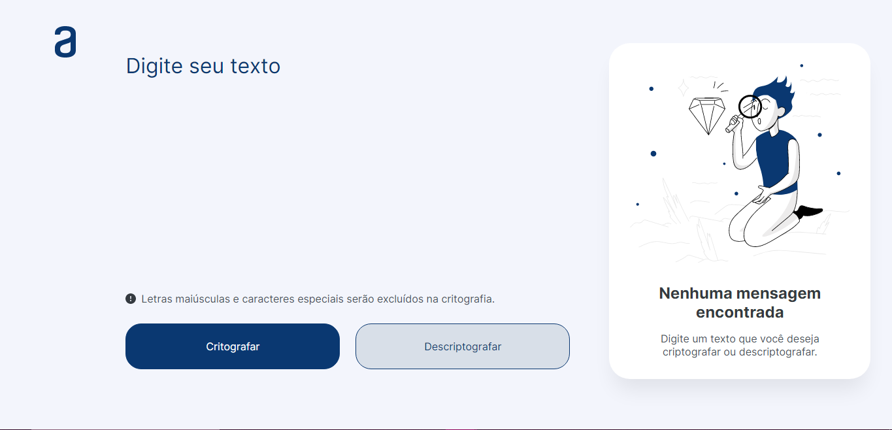

<h1 align="center"> Decodificador Alura ONE </h1>

<p align="center">
Codificador e decodificador desenvolvido como Challenge número 01 da ONE, curso de parceria entre a Alura e a Oracle. <br/>
</p>

<p align="center">
  <a href="#-tecnologias">Tecnologias</a>&nbsp;&nbsp;&nbsp;|&nbsp;&nbsp;&nbsp;
  <a href="#-deploy">Deploy</a>&nbsp;&nbsp;&nbsp;|&nbsp;&nbsp;&nbsp;
  <a href="#-english-version">English Version</a>&nbsp;&nbsp;&nbsp;&nbsp;&nbsp;&nbsp;
</p>

<p align="center">
  
</p>

## 🚀 Tecnologias

Esse projeto foi desenvolvido com as seguintes tecnologias:

- HTML e CSS
- JavaScript
- Git e Github
- Figma

## 💻 Deploy

> [Clique aqui para navegar para o projeto!](https://ssschneider.github.io/alura-challenge-01/)


<!-- ## 💻 Rode Local
---
Para rodar o projeto localmente, basta cumprir as seguintes etapas:

1. Git clone
2. Git install
3. Npm start -->

## 🌎 English Version

Alura Decoder is a project developed as a challenge from the ONE program, offered by Alura Latam and Oracle. To do that, I've used:
- HTML, CSS, Javascript, Git, Github and Figma

> You can check out the deploy by [clicking here](https://ssschneider.github.io/alura-challenge-01/)!
<!-- ```
ETAPAS PARA RODAR LOCAL EM PROJETOS MAIS COMPLEXOS
``` -->

---
### Desenvolvido por Sarah Schneider 🖖